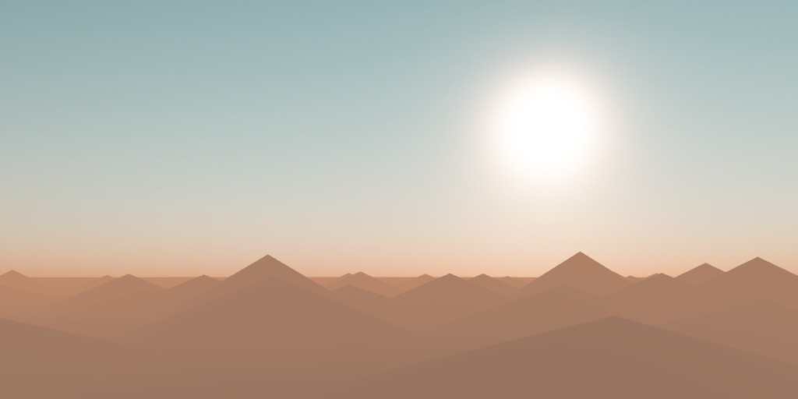
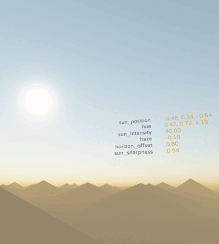

# lovr-atmo



Provides a decent starting environment for sunny [LÖVR](https://lovr.org/) projects.

Sky rendering uses a model of the light scattering through the atmosphere with exposed parameters to modify appearance of sun and the sky. For better performance the atmosphere is rendered onto skybox texture. The color of horizon is made available so it can affect the color of fog or any other scene object.

A quick way to get this up and running is:

```Lua
local atmo = require('atmo')
local skybox = require('skybox').new() -- or new(512) for hi-res

skybox:bake(atmo.draw) -- renders atmosphere into texture

function lovr.draw(pass)
    skybox:draw(pass)
    -- atmo.draw(pass) -- render directly without skybox
end
```

The atmosphere has some parameters that can be tweaked:
```Lua
atmo.gpu.haze = 0.1 -- controls size of sun's halo
atmo.gpu.horizon_offset = 1 -- moves the horizon line up or down
atmo.gpu.sun_intensity = 40 -- brightness of sun's disk
atmo.gpu.sun_sharpness = 0.95  -- controls the halo around the sun
atmo.gpu.sun_position = Vec3(1, 1, -1) -- direction, or normalized position of sun in the sky
atmo.gpu.gamma_correction = 2.2 -- gamma for contrast and brightness adjustment
atmo.gpu.hue = Vec3(0.2, 0.6, 1.0) -- scattering rgb parameters that affect the overall hue
```



The included `main.lua` example allows playing with atmosphere options to obtain the perfect settings. It features a basic fog model and some unrealistically scaled terrain.

A good overview of the technique can be found in the [Simulating the Colors of the Sky](https://www.scratchapixel.com/lessons/procedural-generation-virtual-worlds/simulating-sky/simulating-colors-of-the-sky) article. Credit for the sun and atmosphere shader goes to [glsl-atmosphere](https://github.com/wwwtyro/glsl-atmosphere) repository (MIT license) by Rye Terrell.

The `skybox.lua` code by itself can be used for baking any scene onto the skybox. Best used for static scenes where objects are far away from camera.
